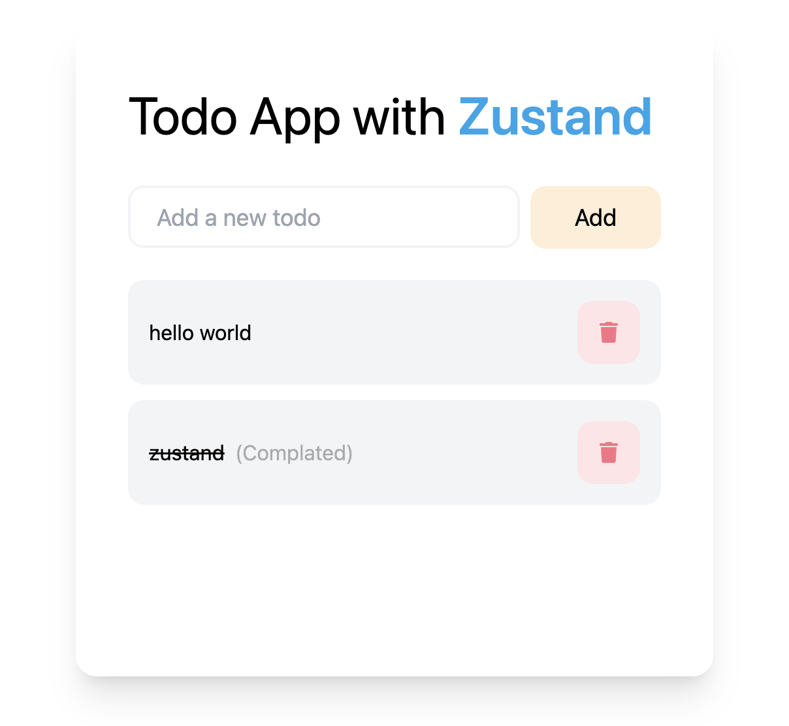

# Todo App with Zustand

<p align="center">
  
</p>


[](https://travis-ci.org/pmndrs/zustand)
[](https://www.npmjs.com/package/zustand)
[](https://bundlephobia.com/result?p=zustand)
[](https://codecov.io/gh/pmndrs/zustand)
[](https://github.com/pmndrs/zustand/pulls)
[](https://app.netlify.com/sites/zustand/deploys)

Zustand, React uygulamaları için basit ve ölçeklenebilir bir durum yönetimi kütüphanesidir. React Hook API'sini kullanarak, bileşen ağaçlarınız boyunca paylaşılan durumu kolayca yönetmenizi sağlar.

Zustand is a simple and scalable state management library for React applications. It allows you to easily manage shared state across your component trees using the React Hook API.

## Özellikler

- Basit ve temiz API ile hızlı entegrasyon
- Minik boyut, performans odaklıdır
- TypeScript ile tam uyumluluk
- Paylaşılan durumu bileşenler arasında kolayca paylaşma
- Redux gibi karmaşık yapıları gerekli kılmadan güçlü bir durum yönetimi
- Middleware desteği ile özelleştirilebilirliğin artırılması

## Kurulum

Zustand'ı projenize eklemek için aşağıdaki komutları kullanabilirsiniz:

```bash
npm install zustand
# veya
yarn add zustand
```
<p align="center">
  
</p>


